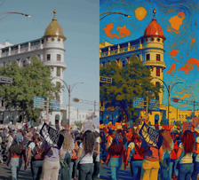
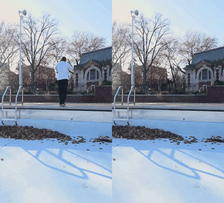
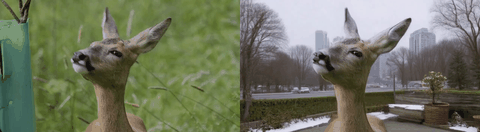
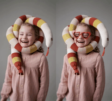

<h1>
<span style="color: #6fa8dc;">K</span><span style="color: #6fb051;">i</span><span style="color: #e06766;">w</span><span style="color: #f6b26b;">i</span>-Edit: Versatile Video Editing via Instruction and Reference Guidance
</h1>
<p align="center">
  🌐 <a href="https://showlab.github.io/Kiwi-Edit">Project Page</a>&nbsp | 📑 <a href=https://arxiv.org/abs/2603.02175>Paper</a>&nbsp |  🤗 <a href="https://huggingface.co/collections/linyq/kiwi-edit">Models(🧨)</a> | 🤗 <a href="https://huggingface.co/datasets/linyq/kiwi_edit_training_data">Datasets</a>
</p>

Kiwi-Edit is a versatile video editing framework built on an MLLM encoder and a video DiT for:
- instruction video editing
- reference image + instruction video editing

## Visualization Demos

<div class="gif-switcher">
  <input type="radio" name="gif-sample" id="sample1" checked>
  <input type="radio" name="gif-sample" id="sample2">
  <input type="radio" name="gif-sample" id="sample3">
  <input type="radio" name="gif-sample" id="sample4">
  <input type="radio" name="gif-sample" id="sample5">
  <input type="radio" name="gif-sample" id="sample6">
  <input type="radio" name="gif-sample" id="sample7">

  <div class="gif-controls">
    <label for="sample1">Style</label>
    <label for="sample2">Replace</label>
    <label for="sample3">Add</label>
    <label for="sample4">Remove</label>
    <label for="sample5">Background Replace</label>
    <label for="sample6">Subject Reference</label>
    <label for="sample7">Background Reference</label>
  </div>

  <div class="gif-slides">
    <div class="gif-slide slide1">
      
      <p class="gif-caption">"Apply the dynamic aesthetic of abstract art to this video."</p>
    </div>
    <div class="gif-slide slide2">
      
      <p class="gif-caption">"Replace the sofa with a classic brown leather sofa with visible stitching."</p>
    </div>
    <div class="gif-slide slide3">
      
      <p class="gif-caption">"Add a classic brown fedora hat to the boy's head."</p>
    </div>
    <div class="gif-slide slide4">
      
      <p class="gif-caption">"Remove the person wearing a light blue shirt and dark pants from the entire video sequence."</p>
    </div>
    <div class="gif-slide slide5">
      
      <p class="gif-caption">"Replace the background with a lively urban garden scene during winter."</p>
    </div>
    <div class="gif-slide slide6">
      <div class="gif-with-ref">
        <div class="ref-slot">
          
        </div>
        
      </div>
      <p class="gif-caption">"Add a pair of iconic red heart-shaped sunglasses to the girl's face."</p>
    </div>
    <div class="gif-slide slide7">
      <div class="gif-with-ref">
        <div class="ref-slot">
          
        </div>
        
      </div>
      <p class="gif-caption">"Replace the background with a Chinese ink painting, featuring a large golden mountain peak rising above swirling clouds."</p>
    </div>
  </div>
</div>

<style>
  .gif-switcher input[type="radio"] {
    display: none;
  }
  .gif-controls {
    margin: 8px 0 12px;
  }
  .gif-controls label {
    display: inline-block;
    margin-right: 6px;
    padding: 4px 10px;
    border: 1px solid #d0d7de;
    border-radius: 999px;
    cursor: pointer;
    font-size: 13px;
  }
  .gif-slide {
    display: none;
    margin: 0 auto;
  }
  .gif-slide img {
    display: block;
    width: auto;
    max-width: 720px;
    max-height: 720px;
    margin: 0 auto;
    border-radius: 8px;
  }
  .gif-with-ref {
    display: flex;
    justify-content: center;
    align-items: center;
    gap: 12px;
    flex-wrap: wrap;
  }
  .ref-slot {
    min-width: 220px;
    min-height: 220px;
    padding: 8px;
    border: 1px dashed #d0d7de;
    border-radius: 8px;
    display: flex;
    align-items: center;
    justify-content: center;
    background: #f6f8fa;
  }
  .ref-slot .ref-image {
    max-height: 224px;
    max-width: 224px;
    width: auto;
  }
  .gif-caption {
    margin: 8px 0 0;
    color: #57606a;
    font-size: 14px;
    text-align: center;
  }
  #sample1:checked ~ .gif-slides .slide1 {
    display: block;
  }
  #sample2:checked ~ .gif-slides .slide2 {
    display: block;
  }
  #sample3:checked ~ .gif-slides .slide3 {
    display: block;
  }
  #sample4:checked ~ .gif-slides .slide4 {
    display: block;
  }
  #sample5:checked ~ .gif-slides .slide5 {
    display: block;
  }
  #sample6:checked ~ .gif-slides .slide6 {
    display: block;
  }
  #sample7:checked ~ .gif-slides .slide7 {
    display: block;
  }
  #sample1:checked ~ .gif-controls label[for="sample1"],
  #sample2:checked ~ .gif-controls label[for="sample2"],
  #sample3:checked ~ .gif-controls label[for="sample3"],
  #sample4:checked ~ .gif-controls label[for="sample4"],
  #sample5:checked ~ .gif-controls label[for="sample5"],
  #sample6:checked ~ .gif-controls label[for="sample6"],
  #sample7:checked ~ .gif-controls label[for="sample7"] {
    background: #24292e;
    border-color: #24292e;
    color: #fff;
  }
</style>

## News

- [2026-03-03] Code and model released.

## Quick Start

**Environment Requirements**

- Python 3.10 + CUDA 12.8 environment
- PyTorch==2.7, Accelerate
- For training: DeepSpeed, FlashAttention

### Full Environment Installation

**1) Prepare environment and base weights:**
```bash
# Create conda environment
conda create -n diffsynth python=3.10 -y
conda activate diffsynth
# Install PyTorch 2.7 with CUDA
pip install torch==2.7.0 torchvision==0.22.0 torchaudio==2.7.0 --index-url https://download.pytorch.org/whl/cu128
pip install -e .
conda install mpi4py -y
pip install deepspeed
pip install https://github.com/Dao-AILab/flash-attention/releases/download/v2.8.3/flash_attn-2.8.3+cu12torch2.7cxx11abiFALSE-cp310-cp310-linux_x86_64.whl
pip install transformers==4.57.0 huggingface-hub==0.34 wandb
# Prepare the pretrained video dit
mkdir -p models/Wan-AI/
# Please login first
hf download Wan-AI/Wan2.2-TI2V-5B --local-dir ./models/Wan-AI/Wan2.2-TI2V-5B
```

or

```bash
bash install_full_env.sh
```

**2) Run a quick test on demo video:**

```bash
python demo.py \
  --ckpt_path path_to_checkpoint \
  --video_path ./demo_data/video/source/0005e4ad9f49814db1d3f2296b911abf.mp4 \
  --prompt "Remove the monkey." \
  --save_path ./output/demo_output.mp4
```
### Diffusers Inference Environment Installation
**1) Prepare environment:**

```bash
# Create conda environment
conda create -n diffusers python=3.10 -y
conda activate diffusers
# Install PyTorch 2.7 with CUDA
pip install torch==2.7.0 torchvision==0.22.0 torchaudio==2.7.0 --index-url https://download.pytorch.org/whl/cu128
pip install diffusers decord einops accelerate transformers==4.57.0 opencv-python av
```

or

```bash
bash install_diffusers_env.sh
```

**2) Run a quick test on demo video:**

```bash
python diffusers_demo.py \
    --video_path ./demo_data/video/source/0005e4ad9f49814db1d3f2296b911abf.mp4 \
    --prompt "Remove the monkey." \
    --save_path output.mp4 --model_path linyq/kiwi-edit-5b-instruct-only-diffusers
```

## Training and Evaluation

### Dataset Format

All training metadata uses CSV; we provide demo data in the repo:

- Image stage: `src_video`, `tgt_video`, `prompt`  
  Example: `demo_data/image_demo_training_set.csv`
- Video stage: `src_video`, `tgt_video`, `prompt`  
  Example: `demo_data/video_demo_training_set.csv`
- Reference-video stage: `src_video`, `tgt_video`, `ref_image`, `prompt`  
  Example: `demo_data/video_ref_demo_training_set.csv`

For full data training, please refer to [DATASET.md](DATASET.md).

### Training

Use the provided scripts in `scripts/`. Example:

```bash
bash scripts/run_wan2.2_ti2v_5b_qwen25vl_3b_stage3_img_vid_refvid_720x1280_81f.sh
```

Training scripts, key parameters, and placeholder links:

| Script | Model Size | Training Stage (Data) | Max Pixels | Frames | LR | Steps | Model Weights |
| - | - | - | - | - | - | - | - |
| [link](scripts/run_wan2.2_ti2v_5b_qwen25vl_3b_stage1_img_1024x1024_1f.sh) | [Qwen2.5-VL-3B](https://huggingface.co/Qwen/Qwen2.5-VL-3B-Instruct)+[Wan2.2-TI2V-5B](https://huggingface.co/Wan-AI/Wan2.2-TI2V-5B) | Stage 1 (Image) | 1024x1024 | 1 | 1e-5 | 30K | [link](https://huggingface.co/linyq/wan2.2_ti2v_5b_qwen25vl_3b_stage1_img_only) |
| [link](scripts/run_wan2.2_ti2v_5b_qwen25vl_3b_stage2_img_vid_600x600_81f.sh) | [Qwen2.5-VL-3B](https://huggingface.co/Qwen/Qwen2.5-VL-3B-Instruct)+[Wan2.2-TI2V-5B](https://huggingface.co/Wan-AI/Wan2.2-TI2V-5B) | Stage 2 (Image + Video) | 600x600 | 81 | 1e-5 | 20K | [link](https://huggingface.co/linyq/wan2.2_ti2v_5b_qwen25vl_3b_stage2_img_vid_600x600_81f) |
| [link](scripts/run_wan2.2_ti2v_5b_qwen25vl_3b_stage2_img_vid_720x1280_81f.sh) | [Qwen2.5-VL-3B](https://huggingface.co/Qwen/Qwen2.5-VL-3B-Instruct)+[Wan2.2-TI2V-5B](https://huggingface.co/Wan-AI/Wan2.2-TI2V-5B) | Stage 2 (Image + Video) | 720x1280 | 81 | 1e-5 | 20K | [link](https://huggingface.co/linyq/wan2.2_ti2v_5b_qwen25vl_3b_stage2_img_vid_720x1280_81f) |
| [link](scripts/run_wan2.2_ti2v_5b_qwen25vl_3b_stage3_img_vid_refvid_720x1280_81f.sh) | [Qwen2.5-VL-3B](https://huggingface.co/Qwen/Qwen2.5-VL-3B-Instruct)+[Wan2.2-TI2V-5B](https://huggingface.co/Wan-AI/Wan2.2-TI2V-5B) | Stage 3 (Image + Video + Ref-Video) | 720x1280 | 81 | 5e-6 | 15K | [link](https://huggingface.co/linyq/wan2.2_ti2v_5b_qwen25vl_3b_stage3_img_vid_refvid_720x1280_81f) |
| [link](scripts/run_wan2.2_ti2v_5b_qwen25vl_3b_stage3_refvid_720x1280_81f.sh) | [Qwen2.5-VL-3B](https://huggingface.co/Qwen/Qwen2.5-VL-3B-Instruct)+[Wan2.2-TI2V-5B](https://huggingface.co/Wan-AI/Wan2.2-TI2V-5B) | Stage 3 (Ref-Video) | 720x1280 | 81 | 5e-6 | 30K | [link](https://huggingface.co/linyq/wan2.2_ti2v_5b_qwen25vl_3b_stage3_refvid_only_720x1280_81f_pad_first) |


### Evaluation
For benchmark inference example:
```bash
python infer.py \
  --ckpt_path path_to_ckpt \
  --bench openve \  # or refvie
  --max_frame 81 \
  --max_pixels 921600 \
  --save_dir ./infer_results/exp_name/
```
For score evaluation, see `eval_openve_gemini.py` and `eval_refvie_gemini.py`.

Example:

```bash
python eval_openve_gemini.py --video_paths path_to_videos
```

### Additional Notes

- Review and secure API key handling before running Gemini-based evaluation scripts.
- For Diffusers conversion, see `utils/convert_diffusers/README.md`.
- Default benchmark paths in inference scripts assume datasets are under `./benchmark/...`.

## Acknowledgements

Kiwi-Edit builds on training framework [ModelScope DiffSynth-Studio](https://github.com/modelscope/DiffSynth-Studio), open-sourced datasets [Ditto-1M](https://huggingface.co/datasets/QingyanBai/Ditto-1M/tree/main/videos/source), [OpenVE-3M](https://huggingface.co/datasets/Lewandofski/OpenVE-3M), [ReCo](https://huggingface.co/datasets/HiDream-ai/ReCo-Data/tree/main), [GPT-Image-Edit-1.5M](https://huggingface.co/datasets/UCSC-VLAA/GPT-Image-Edit-1.5M), [NHR-Edit](https://huggingface.co/datasets/iitolstykh/NHR-Edit), reward model [EditScore](https://github.com/VectorSpaceLab/EditScore) and image generation model [Qwen-Image-Edit](https://huggingface.co/Qwen/Qwen-Image-Edit-2511).

## Citation

If you use our code in your work, please cite [our paper](https://arxiv.org/abs/2603.02175):

```bibtex
@misc{kiwiedit,
      title={Kiwi-Edit: Versatile Video Editing via Instruction and Reference Guidance}, 
      author={Yiqi Lin and Guoqiang Liang and Ziyun Zeng and Zechen Bai and Yanzhe Chen and Mike Zheng Shou},
      year={2026},
      eprint={2603.02175},
      archivePrefix={arXiv},
      primaryClass={cs.CV},
      url={https://arxiv.org/abs/2603.02175}, 
}
```
